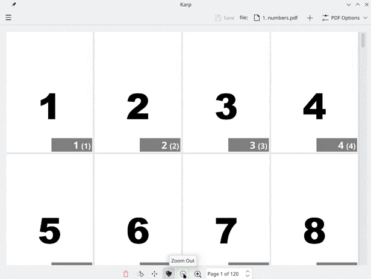

#   Karp - KDE arranger for PDFs

Simple PDF editor which can select, delete, rearrange pages, merge PDF files and reduce file size.

Karp uses [Kirigami framework](https://invent.kde.org/frameworks/kirigami)

For arranging PDF files [libqpdf](https://qpdf.sourceforge.io) is used.  
To reduce PDF size Karp calls [GPL Ghostscript](https://www.ghostscript.com)  

#### Supported features
 * Merging PDF files, reordering
 * Reordering pages
 * Removing pages
 * Rotating pages
 * Reducing PDF file size
 * Optimizing images (if possible)
 * Viewing, editing PDF properties (metadata)
 * Protect PDF file with password

#### Planned features
 * Editing bookmarks
 * Merging 2 PDFs: one for even pages and another one for odd pages
 * Resizing pages
 * Extracting images
 * Adding watermark
 * Adding page numbers or other labels
 * Improving image quality, text visibility
